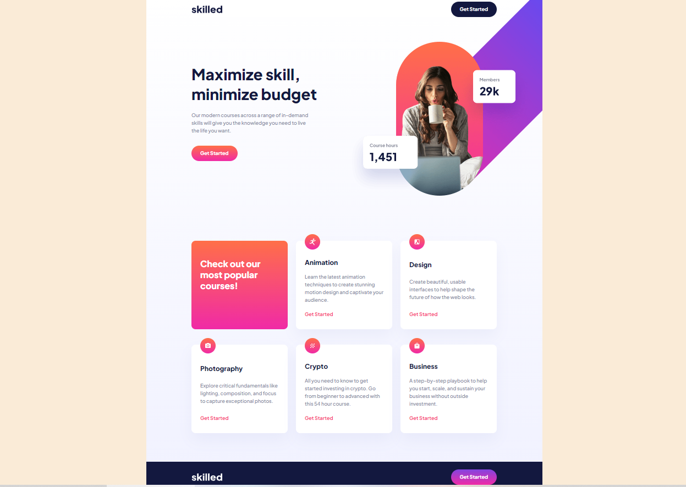

# Frontend Mentor - §§§§§§TITRE A AFFICHER 1/8 §§§§§

This is a solution to the [Skilled e-learning landing page challenge on Frontend Mentor](https://www.frontendmentor.io/challenges/skilled-elearning-landing-page-S1ObDrZ8q). Frontend Mentor challenges help you improve your coding skills by building realistic projects.

## Table of contents

- [Overview](#overview)
- [The challenge](#the-challenge)
- [Screenshot](#screenshot)
- [Links](#links)
- [Author](#author)

### The challenge

Users should be able to:

- View the optimal layout depending on their device's screen size
- See hover states for interactive elements

### Screenshot

### Links

- Solution URL: (https://github.com/DavidDelannoyDeveloppement/1P-skilled-elearning-landing-page)
- Live Site URL: (https://daviddelannoydeveloppement.github.io/1P-skilled-elearning-landing-page/)

## Author

- Website - [DavidDelannoyDeveloppement](https://daviddelannoydeveloppement.github.io/DDD/index.html)
- Frontend Mentor - [@DavidDelannoyDeveloppement](https://www.frontendmentor.io/profile/DavidDelannoyDeveloppement)
- Github - [DavidDelannoyDeveloppement](https://github.com/DavidDelannoyDeveloppement)
